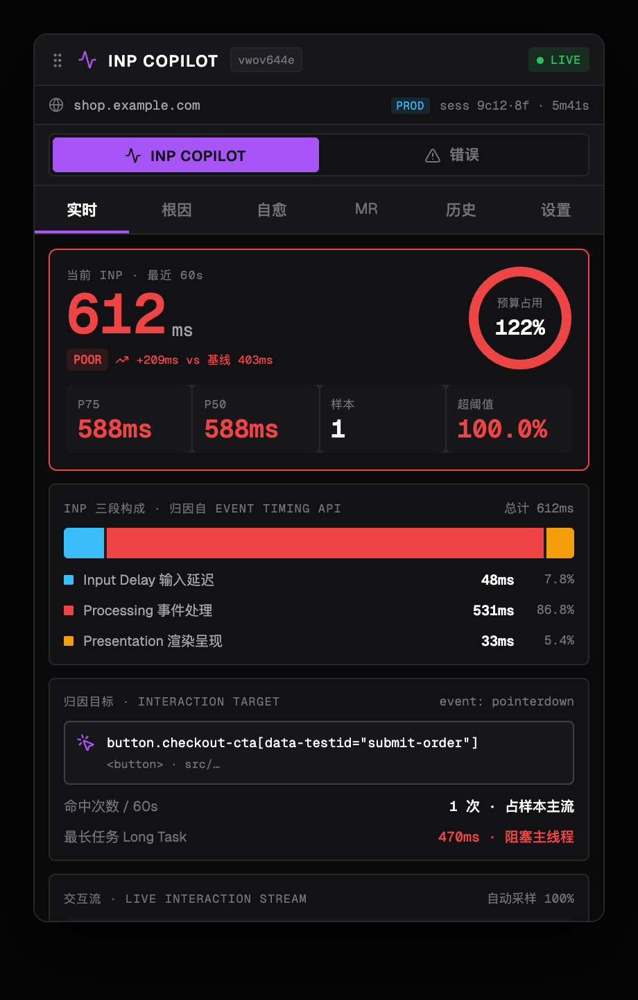
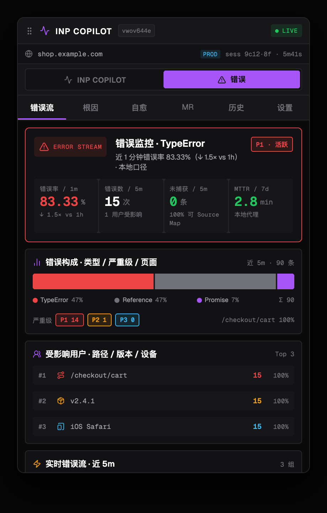
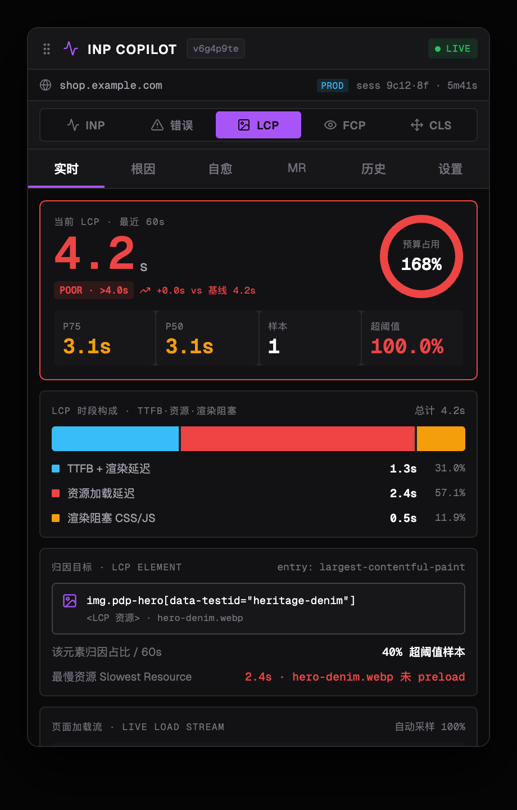

# Vitals Copilot · 前端可观测 + 诊断 + 自愈（Chrome MV3 扩展）

> 任意页面**零集成**采集 **INP / LCP / FCP / CLS + JS 错误**，三段归因 → 模板化自愈 → MR 草稿的端到端闭环。**数据全本地 IndexedDB，零后端，不外发**。

一个浏览器扩展（Chrome MV3 / Edge / 其他 Chromium）。打开侧边栏即可看到当前页面的真实性能与错误指标，一键钻取根因、试用模板自愈、生成 MR 草稿。无需被测应用接入任何 SDK。



---

## 为什么

前端性能/错误问题大多在**真实用户环境**才暴露，而现有工具要么需要应用接入 SDK（改代码、发版），要么是纯在线 SaaS（数据出域、要账号）。Vitals Copilot 走第三条路：**浏览器扩展级兜底采集 + 纯本地分析**——任何页面、零改代码、数据不出浏览器。

覆盖 5 个信号的完整闭环（监控 → 归因 → 自愈 → MR → 回写历史）：

| 信号 | 采集 | 实时 | 根因 | 自愈模板 | MR 草稿 |
|---|---|---|---|---|---|
| **INP** | Event Timing + LoAF | ✓ | ✓ 三段判定 | debounce / memo / cleanup | ✓ |
| **LCP** | largest-contentful-paint + 资源时序 | ✓ | ✓ TTFB·资源·渲染阻塞 | preload / defer CSS | ✓ |
| **FCP** | first-contentful-paint + Navigation Timing | ✓ | ✓ TTFB·阻塞·解析 | defer CSS | ✓ |
| **CLS** | layout-shift + sources[] | ✓ | ✓ 无尺寸/字体/动态 DOM | size attrs / font-display | ✓ |
| **错误** | window.onerror / unhandledrejection / 资源 | ✓ 错误流 | ✓ 栈还原 + 候选链 | 可选链 / await 守卫 | ✓ |

 

---

## 安装（Load Unpacked）

1. 下载/克隆本目录 `platform/extension/`。
2. 打开 `chrome://extensions`，开启右上角「开发者模式」。
3. 点「加载已解压的扩展程序」，选中 `extension/` 目录。
4. 打开任意网页，点工具栏的 Vitals Copilot 图标（或用 Chrome 侧边栏面板）。

> 也支持 Edge / 任意 Chromium 浏览器。无需账号、无需联网。

**快速预览（不装扩展）**：浏览器直接打开 `preview.html`（内置样本数据，用于看 UI/布局）。

---

## 架构（真实跨上下文数据流）

```
  页面 (任意 origin)                         扩展 (chrome-extension://<id>)
 ┌─────────────────────────┐              ┌───────────────────────────────────┐
 │ content.js (isolated)   │  INP_UPDATE  │ background.js (service worker)    │
 │  PerformanceObserver ──┼─────────────►│  latest live 缓存 ──► sidepanel   │
 │  (INP/LCP/FCP/CLS/错误) │  EVENT       │  事件缓冲 (chrome.storage, 抗 SW  │
 │                         │─────────────►│   终止, cap 500) ──转发──► sidepanel│
 │ heal-templates.js       │              │                                   │
 │  (world: MAIN) ◄────────┼──────────────┼  scripting.executeScript(MAIN)    │
 └─────────────────────────┘   apply      │           ▲                       │
                                        ┌─┴───────────────────────────────────┐
                                        │ sidepanel.html (React, vendored)    │
                                        │  写 IndexedDB(扩展 origin) ◄ flush  │
                                        │  读 IndexedDB → 实时/历史/根因/MR UI │
                                        └─────────────────────────────────────┘
```

**关键点**：事件统一落到**扩展 origin 的 IndexedDB**（`db.js`，background 与 sidepanel 共享同一库）。
- `content.js` **不写存储**（页面 origin 与扩展 origin 的存储不共享），只把事件消息发给 background。
- `background.js` 缓冲到 `chrome.storage.local`（抗 service worker 终止）并转发 sidepanel。
- `sidepanel`（持久页面）负责写入 IndexedDB；开屏时先 flush background 缓冲，把关闭期间累积的事件补齐。

## 自愈（实验性）

「模板化自愈」在**当前页面 MAIN world** 注入预编译 prototype patch（如给 click/input/keydown listener 加 debounce、第三方 script 加 async/defer）。patch **仅影响当前标签页运行时、刷新即失效、不改文件/网络**。每个 patch 带 rollback token，可在面板回滚。详见 [PRIVACY.md](PRIVACY.md)。

> 真·可回滚的热修（patch-registry-over-SDK + HMAC 签名）在配套的 `packages/collector` + `coordinator`，扩展侧为轻量试验场。

## Source Map · 真实源码还原（根因分析）

错误捕获后，`content.js` 自动按 `//# sourceMappingURL=`（或 `bundle.js.map`）拉取 source map，用内置极简消费器（`sourcemap.js`，零依赖，VLQ+mappings，与官方 `source-map` 库对齐验证）把压缩栈还原到**源文件:行:列 + sourcesContent 实际代码**。根因视图的「代码定位」卡直接展示真实源码并高亮出错行。

- **dev**：bundle 带 `sourceMappingURL` 即自动还原（同源；跨域 CDN 可能被 CORS 拦截 → 自动跳过）。
- **prod**：把 `.map` 与 bundle 同源可访问；或设置卡里关闭「自动还原」省请求。
- 设置卡：**Source Map · 根因源码还原** 开关（默认开）。

## 悬浮浮层 · 压在页面之上

点工具栏图标 → 在**当前页面**注入一个 fixed 高 z-index 浮层（content script + Shadow DOM 外壳 + iframe 载入 `sidepanel.html`）。
- **可拖拽**（按标题栏移动）、**可缩放**（右下角拖拽）、**可最小化**为「◆ COPILOT」小 chip，再点展开。
- **一直存在**：开关与位置记在 `chrome.storage`，跨页面导航自动恢复（mac 上不像独立弹窗会跑到浏览器后面）。
- 浮层内的 iframe 在**扩展 origin** 运行 → 自动有 chrome API + 真实 IndexedDB + sourcemap 还原，UI 与侧边栏完全一致、零重复。
- 部分严格 CSP 页面可能拒绝嵌入 `chrome-extension://` iframe（浮层不显示）—— 属浏览器安全限制。

> 也仍提供 `chrome.sidePanel`（manifest 声明），供偏好原生侧栏的用户使用。

---

## 项目结构

```
extension/
├── manifest.json          # MV3：content_scripts(采集+MAIN-heal) / background(SW) / side_panel
├── sidepanel.html         # 面板入口（加载 vendored React + 各模块）
├── background.js          # SW：消息中转 / latest 缓存 / 事件缓冲 / self-test / 自愈调度
├── content.js             # 采集：INP/LoAF/FCP/LCP/CLS/错误 → 消息发给 background
├── heal-templates.js      # 5 模板（MAIN world prototype patch + rollback）
├── db.js                  # IndexedDB 4-store 封装（events/attributions/heals/mrs）
├── diagnose.js            # INP 确定性根因规则引擎
├── error-diagnose.js      # 错误根因规则引擎（null_access / async_race / chunkload …）
├── data.js                # SIGNALS 描述符 + loadVital + 统一根因封装（local 优先）
├── mr-draft.js            # MR 草稿（unified diff，跨 INP/错误/vital 模板）
├── icons.js  ui.js        # lucide 内联图标 / 共享 UI 原子
├── inp-panels.js  error-panels.js  app.js   # INP 域 / 错误域 / 主壳路由
├── icons/  fonts/  vendor/           # 图标 / Geist 字体 / React UMD
├── preview.html  preview-data.js     # 开发预览（样本数据，不入 manifest）
├── LICENSE  PRIVACY.md  README.md    # MIT / 隐私 / 本文件
└── screenshots/                      # README 截图
```

## 开发

- 纯静态、**无构建**：改完 JS 直接在 `chrome://extensions` 点扩展卡上的「刷新」即可。
- UI 全 `React.createElement`（vendored UMD，无打包），样式用 `:root` CSS 变量。
- 图标生成：`node tools/gen-icons.mjs icons/`（puppeteer 渲染 SVG；脚本见仓库）。
- 字体：自托管 Geist / Geist Mono（`fonts/`，fontsource）。

## 已知限制

- **零后端**：跨用户聚合（真·MTTR / CI / Reviewer / 全站错误率）本地不可得，面板用本地口径代理或 `—` 并标注。可选后端接线在路线图。
- 自愈为**试验性** MAIN-world patch，可能影响页面行为（刷新即恢复）。
- 仅 Chromium 系（MV3 service worker / PerformanceObserver LoAF / sidePanel）。

## 许可证

[MIT](LICENSE) © Vitals Copilot contributors.
